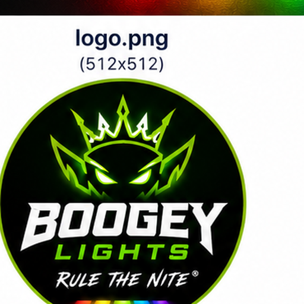

# Boogey Lights Home Assistant Integration

Native Home Assistant integration for Boogey Lights GEN2 Bluetooth RGB controllers.

Control your Boogey Lights directly from Home Assistant and Apple Home without relying on the Boogey mobile application.



---

## Features

### Lighting Control

- RGB color control
- Brightness control
- On/Off control
- Driver Side zone control
- Passenger Side zone control
- All Zones control

### Effects

Supported Boogey lighting effects:

- Steady
- Single Color Strobe
- 7 Color Strobe
- 7 Color Switching
- Single Color Breathing
- 7 Color Breathing
- 7 Color Morphing

### Home Assistant Integration

- Native Light entities
- Bluetooth discovery
- Config Flow setup
- Persistent BLE connection
- Fast command execution
- Automatic reconnect handling
- Automatic recovery from RGB-disabled controller states

### Apple Home Support

Compatible with Home Assistant's HomeKit Bridge.

Control your Boogey Lights from:

- Apple Home
- Siri
- Home Assistant dashboards
- Home Assistant automations

---

## Tested Hardware

This integration was reverse engineered and validated using:

- Boogey Lights GEN2 Bluetooth Controller
- Dual-zone RGB underglow installation
- Dual Zone HD RF Wireless + Bluetooth Combo Controller

Other GEN2 controllers may also work.

---

## Installation

### Manual Installation

Copy the integration folder into:

```text
config/custom_components/boogey_lights/
```

Restart Home Assistant.

Navigate to:

```text
Settings → Devices & Services → Add Integration → Boogey Lights
```

Select the discovered controller and complete setup.

---

## Entities

The integration exposes three light entities:

### Driver Side

Independent control of the driver-side lighting zone.

### Passenger Side

Independent control of the passenger-side / front / rear lighting zone.

### All Zones

Controls both lighting zones simultaneously.

---

## HomeKit

When exposed through the Home Assistant HomeKit Bridge, Boogey Lights appear as standard HomeKit light accessories.

Supported features include:

- Power
- Brightness
- Color selection

Effects remain available through Home Assistant.

---

## Reverse Engineering Notes

This integration was developed through protocol analysis of the Boogey Lights GEN2 Bluetooth controller.

The following command families were decoded:

| Command | Function |
|---|---|
| `0x10` | Power OFF |
| `0x11` | Power ON |
| `0x20` | Zone 1 RGB OFF |
| `0x21` | Zone 1 RGB ON |
| `0x30` | Zone 2 RGB OFF |
| `0x31` | Zone 2 RGB ON |
| `0x40` | All RGB OFF |
| `0x41` | All RGB ON |

The integration automatically restores controller state and can recover from RGB-disabled conditions without requiring the Boogey mobile application.

---

## Version 1.0.0

### Major Milestones

- Bluetooth protocol decoded
- RGB control implemented
- Effect support implemented
- Zone control implemented
- HomeKit compatibility verified
- Controller recovery implemented
- Persistent BLE connection implemented
- Fast Apple Home response verified

This release is considered production-ready for daily use.

---

## Roadmap

Future enhancements under consideration:

- Effect speed control
- Preset support
- Scene support
- RSSI diagnostics
- Connection metrics
- HACS publication

---

## Branding Assets

This package includes local integration artwork:

- `custom_components/boogey_lights/icon.png`
- `custom_components/boogey_lights/logo.png`
- `assets/icon.png`
- `assets/logo.png`
- `assets/brand_mockup.png`

A Home Assistant Brands-compatible folder is also included under:

```text
brands/custom_integrations/boogey_lights/
```

---

## Acknowledgements

Special thanks to the Home Assistant community and the reverse-engineering tools that made protocol analysis possible.

---

**Boogey Lights v1.0.0 — Protocol Conquered**

All your base are belong to us.
