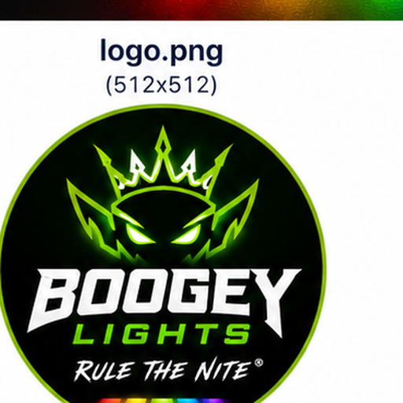

# Boogey Lights Home Assistant Integration

Native Home Assistant integration for Boogey Lights GEN2 Bluetooth RGB controllers.

Control your Boogey Lights directly from Home Assistant and Apple Home without relying on the Boogey mobile application.



---

## Features

### Lighting Control

- RGB color control
- Brightness control
- On/Off control
- Driver Side zone control
- Passenger Side zone control
- All Zones control

### Effects

Supported Boogey lighting effects:

- Steady
- Single Color Strobe
- 7 Color Strobe
- 7 Color Switching
- Single Color Breathing
- 7 Color Breathing
- 7 Color Morphing

### Home Assistant Integration

- Native Light entities
- Bluetooth discovery
- Config Flow setup
- Warm BLE connection with automatic idle release
- Fast command execution
- Automatic reconnect handling
- Automatic recovery from RGB-disabled controller states
- Transactional controller operations
- Shared All/Zone commanded-state synchronization
- Bounded cold-connect advertisement recovery

### Apple Home Support

Compatible with Home Assistant's HomeKit Bridge.

Control your Boogey Lights from:

- Apple Home
- Siri
- Home Assistant dashboards
- Home Assistant automations

---

## Tested Hardware

This integration was reverse engineered and validated using:

- Boogey Lights GEN2 Bluetooth Controller
- Dual-zone RGB underglow installation
- Dual Zone HD RF Wireless + Bluetooth Combo Controller

Other GEN2 controllers may also work.

---

## Installation

### Manual Installation

Copy the integration folder into:

```text
config/custom_components/boogey_lights/
```

Restart Home Assistant.

Navigate to:

```text
Settings → Devices & Services → Add Integration → Boogey Lights
```

Select the discovered controller and complete setup.

---

## Entities

The integration exposes three light entities:

### Driver Side

Independent control of the driver-side lighting zone.

### Passenger Side

Independent control of the passenger-side / front / rear lighting zone.

### All Zones

Controls both lighting zones simultaneously.

---

## HomeKit

When exposed through the Home Assistant HomeKit Bridge, Boogey Lights appear as standard HomeKit light accessories.

Supported features include:

- Power
- Brightness
- Color selection

Effects remain available through Home Assistant.

---

## Reverse Engineering Notes

This integration was developed through protocol analysis of the Boogey Lights GEN2 Bluetooth controller.

The following command families were decoded:

| Command | Function |
|---|---|
| `0x10` | Power OFF |
| `0x11` | Power ON |
| `0x20` | Zone 1 RGB OFF |
| `0x21` | Zone 1 RGB ON |
| `0x30` | Zone 2 RGB OFF |
| `0x31` | Zone 2 RGB ON |
| `0x40` | All RGB OFF |
| `0x41` | All RGB ON |

The integration explicitly normalizes controller power and RGB-enable state on
every ON operation. All OFF disables both zones and master power as one
serialized transaction. The controller exposes no verified state telemetry, so
Home Assistant reports the last successfully completed command rather than
claiming to have read the controller.

---

## Version 1.1.5

Contains expected Bluetooth failures without aborting HA scripts, bounds complete
operations, and commits color state only after successful writes. Adds command
confirmation diagnostics and an optional verified-shutdown package for Mooterhome.
Connection timing policy remains unchanged while collecting hardware evidence.

See [release notes](RELEASE_NOTES_v1.1.5.md) and the
[installation and validation guide](docs/stabilization-validation.md).

---

## Version 1.1.4

- Adds a three-minute maximum BLE connection lifetime in addition to the
  five-minute idle timeout.
- Refreshes the connection at the next command after that limit, even while an
  active effect is continually sending color updates.
- Serializes each zone's commanded-state decision with its controller
  transaction, preventing simultaneous scene starts from disabling the zone
  that completed first.
- Preserves the warm connection across the two-minute holiday-light preflight
  while preventing a busy show from holding one session indefinitely.

---

## Version 1.1.3

- Waits up to 30 seconds for an idle controller to advertise before failing a
  cold-connect command.
- Applies one bounded deadline across discovery, connection retries, and the
  GATT write so Home Assistant calls cannot hang indefinitely.
- Keeps successful sessions warm for five minutes, allowing a shortly-before-
  dusk preflight to carry into scheduled lighting startup.
- Retains automatic idle release to avoid the long-held-session controller
  lockup addressed in version 1.1.2.

---

## Version 1.1.2

- Releases the BLE connection after 60 seconds without a command.
- Resets the idle timer after each successful write so command bursts continue
  using one warm connection.
- Applies the same idle release to the best-effort startup preconnection.
- Prevents an indefinitely held BLE session from wedging the controller until
  its 12-volt supply is power-cycled.

---

## Version 1.1.1

- Adds a controller-processing pause between commands in multi-packet operations.
- Uses native All ON/OFF commands before per-zone cleanup.
- Normalizes both persistent zone-enable bits whenever either zone is awakened.
- Sends steady-state color changes as one immediate RGB packet.
- Defines All Zones as on only when both physical zones are commanded on.

---

## Version 1.1.0

- Serializes complete multi-packet operations so ON and OFF cannot interleave.
- Explicitly wakes and enables the target on every ON command.
- Rebuilds both persistent zone-enable states for All ON.
- Performs Zone 1 OFF, Zone 2 OFF, All OFF, and Power OFF for All shutdown.
- Synchronizes All, Driver, and Passenger commanded state after successful
  operations.

---

## Version 1.0.0

### Major Milestones

- Bluetooth protocol decoded
- RGB control implemented
- Effect support implemented
- Zone control implemented
- HomeKit compatibility verified
- Controller recovery implemented
- Persistent BLE connection implemented
- Fast Apple Home response verified

This release is considered production-ready for daily use.

---

## Roadmap

Future enhancements under consideration:

- Effect speed control
- Preset support
- Scene support
- RSSI diagnostics
- Connection metrics
- HACS publication

---

## Branding Assets

This package includes local integration artwork:

- `custom_components/boogey_lights/icon.png`
- `custom_components/boogey_lights/logo.png`
- `assets/icon.png`
- `assets/logo.png`
- `assets/brand_mockup.png`

A Home Assistant Brands-compatible folder is also included under:

```text
brands/custom_integrations/boogey_lights/
```

---

## Acknowledgements

Special thanks to the Home Assistant community and the reverse-engineering tools that made protocol analysis possible.

---

**Boogey Lights v1.0.0 — Protocol Conquered**

All your base are belong to us.
